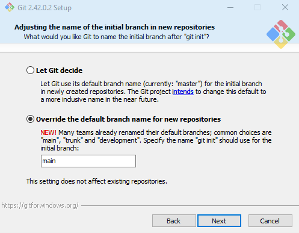

# Guide on Version Control Systems/Git and GitHub
Starting guide to version control systems, namely Git and integrations with a remote repository service like GitHub.

## Table of Contents
1. [Introduction](#introduction)
   * [Keywords and Definitions](#keywords-and-definitions)
   * [What is Git?](#what-is-git)
   * [What is GitHub?](#what-is-github)
2. [Setting Up](#setting-up)
   * [Installation](#installation)
   * [Configuration](#configuration)
3. [Basic Git Commands](#basic-git-commands)
   * [Initialization](#initialization)
   * [Cloning](#cloning)
   * [Adding Files](#adding-files)
   * [Committing Changes](#committing-changes)
   * [Pushing to Remote](#pushing-to-remote)
   * [Pulling from Remote](#pulling-from-remote)
4. [Branching in Git](#branching-in-git)
   * [Creating Branches](#creating-branch)
   * [Switching Branches](#switching-branches)
   * [Merging Branches](#merging-branches)
5. [Using GitHub](#using-github)
   * [Creating a Repository](#creating-a-repository)
   * [Forking a Repository](#forking-a-repository)
   * [Pull Requests](#pull-requests)
   * [GitHub Issues](#github-issues)
   * [GitHub Actions](#github-actions)
6. [Best Practices](#best-practices)
   * [Commit Messages](#commit-messages)
   * [Collaborative Workflow](#collaborative-workflow)
7. [Additional Resources](#additional-resources)
8. [Conclusion](#conclusion)

## Introduction

### Keywords and Definitions
[List of all Keywords and Acryonyms](keywords.md)


**TL;DR** 
1. Git is a software that can keep track of changes in code. This is very helpful if you want to work on a work on a long projects or work with others.
2. GitHub is a website that host Git projects.

### What is Git?
Anybody who writes code knows that it is hard. Over time, code gets messy, and features are added and deleted. It is exponentially more difficult once you work with others people, because now you have to keep track of all changes that other people made.

A workflow of code writing might be as follows:

1. You have a list of files where you write your code.
2. You want to add new features to code.
3. You changed the code in some of the files.
4. You tested and found some parts worked and some parts didn't work.
5. You have to go back, but now you forgot which files you changed.
6. A collaborator made some changes to the code.
7. Some parts of the code didn't work and you have to modify their code to fit your code.

Wouldn't it be nice if there was a way to keep track of which part has been changed, and by whom? **This is the purpose of "Git". Git is a type of software called "version control systems"**. The name tells you everything: Git keeps track of different version of your code.

Git does this by the following:
1. There is a central code base that everyone contributes to called a remote repository. 
2. Each individual makes a copy of the code base and edits it on their own.
3. Inviduals submit the code for review. Approved code make it into the central code base
4. Git keep a log of all changes made by everyone. This means that one person can continue working on a copy of another person's code by simply asking Git what has changed.

A code project is called a **repository** by Git (**repo** for short). 

### What is Github?
Git is a software that track changes in your code. Each project is called a repository. **Github** is a company and a website that host repositories (A "hub of Git repo"). You can use Git to directly access repositories on Github. 

Normally, you use Git, the software, by using the command line. Github, the company, released a software called **GitHub Desktop**. This software helps you manage Git repositories using a GUI. 

## Setting Up

### Installation

To follow through on this tutorial, you need to have three things:
1. Git installed on your computer
2. Visual Studio Code or other text editor installed on your computer. 
3. A GitHub account.

Check if you already have git installed on your computer and by running the command `git --version` in your terminal/command prompt. If you do not have it installed, you can install Git on your computer by following [the installation guide](https://github.com/git-guides/install-git). 

   *  **For Window specific users:** 

         Click through the installer and use the default settings except for when you get to the window below:

         

         Then, select "Override the default branch name for new repositories". This will make sure your default branch is named "main" when initializing git in a new repository. Trust me that it will make your life easier as GitHub and others have moved to the default branch name of "main" instead of "master". 

      \
      Verify that you have installed it correctly by re-running the command above.
      ***Note: The installer for [Windows]](https://gitforwindows.org/) comes with git bash, which is a shell that is bash/Unix-like and is strongly recommend as your default shell as command prompt and PowerShell are bad.***

To install Visual Studio Code, go to [the official installation site](https://code.visualstudio.com/download) and follow the instructions. See [VS Code tutorial](vscode.md)/

To create a GitHub account, go to [GitHub.com](https://github.com/) and sign up for a new account.


### Configuration
Next you should edit your git configuration file to tell Git who you are. This is because every time you make changes to code, Git will keep track that "Person A make the following changes on this date." You do this by putting your name and your email with the following commands

```
git config --global user.name "Your Name"
git config --global user.email your_no_reply_email@users.noreply.github.com
```

Where your email should be the no reply email that you received from GitHub. You can view this under the "email" tab on the left side fo the personal settings page on GitHub. See [GitHub commit email setup](https://docs.github.com/en/account-and-profile/setting-up-and-managing-your-personal-account-on-github/managing-email-preferences/setting-your-commit-email-address) for details.

## Basic Git Commands
https://git-scm.com/docs/git#_git_commands

## Additional Resources
Git has a lot of functionalities. If you want to be proficient, consider the following resources:
1. Github offical tutorial: https://docs.github.com/en/get-started/quickstart/hello-world 
2. Atlassian tutorial: https://www.atlassian.com/git/tutorials/what-is-version-control
3. ChatGPT: https://chat.openai.com/
